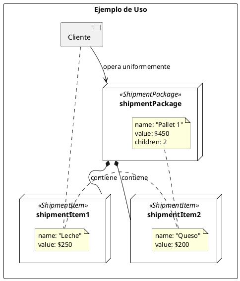

# UML del Patrón Composite - CadenaSuministros

```plantuml
@startuml
skinparam componentStyle uml2

' ============================================
' PATRON COMPOSITE - CADENA SUMINISTROS
' ============================================

package "domain.model.composite" {

    interface "ShipmentComponent" <<sealed>> {
        + getId(): UUID
        + getName(): String
        + getTotalValue(): BigDecimal
        + getProductCount(): int
        + getAllProductIds(): List<String>
        + calculateStatistics(): ShipmentStatistics
        + addChild(component: ShipmentComponent): void
        + removeChild(componentId: UUID): void
        + getChildren(): List<ShipmentComponent>
    }

    class "ShipmentItem" {
        - id: UUID
        - name: String
        - productId: String
        - quantity: int
        - unitPrice: BigDecimal
        - status: String
        + ShipmentItem(...)
        + getId(): UUID
        + getName(): String
        + getTotalValue(): BigDecimal
        + getProductCount(): int
        + getAllProductIds(): List<String>
        + calculateStatistics(): ShipmentStatistics
        + addChild(component: ShipmentComponent): void
        + removeChild(componentId: UUID): void
        + getChildren(): List<ShipmentComponent>
        + getProductId(): String
        + getQuantity(): int
        + getUnitPrice(): BigDecimal
        + getStatus(): String
        + withStatus(newStatus: String): ShipmentItem
    }

    class "ShipmentPackage" {
        - id: UUID
        - name: String
        - packageType: String
        - children: List<ShipmentComponent>
        + ShipmentPackage(...)
        + getId(): UUID
        + getName(): String
        + getTotalValue(): BigDecimal
        + getProductCount(): int
        + getAllProductIds(): List<String>
        + calculateStatistics(): ShipmentStatistics
        + addChild(component: ShipmentComponent): void
        + removeChild(componentId: UUID): void
        + getChildren(): List<ShipmentComponent>
        + getPackageType(): String
        + withAddedChild(component: ShipmentComponent): ShipmentPackage
    }

    record "ShipmentStatistics" {
        + totalItems: int
        + totalProducts: int
        + totalValue: BigDecimal
        + maxValue: BigDecimal
        + minValue: BigDecimal
        + deliveredCount: int
        + pendingCount: int
        + averageValue(): double
        + deliveryRate(): double
    }
}

' Relaciones
ShipmentComponent <|.. ShipmentItem
ShipmentComponent <|.. ShipmentPackage
ShipmentPackage o-- "*" ShipmentComponent : children
ShipmentPackage .> ShipmentStatistics : creates
ShipmentItem .> ShipmentStatistics : creates

@enduml
```

---

## Diagrama Executable

Para visualizar este diagrama:
1. Copia el código entre los bloques \`\`\`plantuml
2. Pégalo en [PlantUML Online Editor](https://www.planttext.com)
3. O usa la extensión **PlantUML** en VS Code

---

## Descripción del UML

| Elemento | Descripción |
|----------|-------------|
| **ShipmentComponent** | Interfaz sellada (sealed) que define el contrato común |
| **ShipmentItem** | Leaf - Envío individual sin hijos |
| **ShipmentPackage** | Composite - Contiene lista de hijos |
| **ShipmentStatistics** | Record con estadísticas calculadas |

### Relaciones

- `ShipmentItem` implementa `ShipmentComponent` (extends)
- `ShipmentPackage` implementa `ShipmentComponent` (extends)
- `ShipmentPackage` tiene composición con `ShipmentComponent` (0..*)
- Ambos crean `ShipmentStatistics`

---

