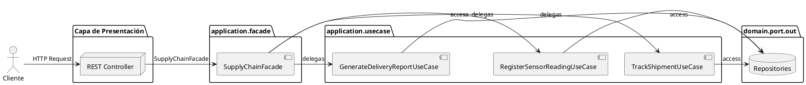
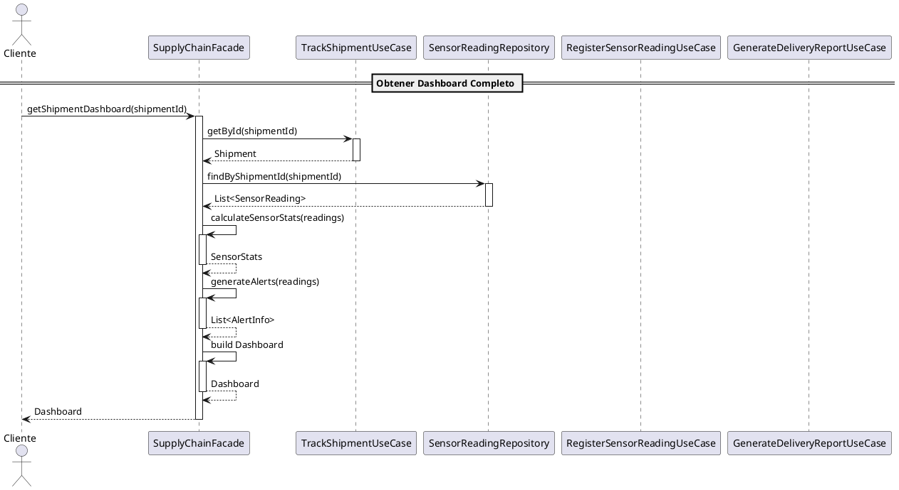

# UML del Patrón Facade - CadenaSuministros

```plantuml
@startuml
skinparam componentStyle uml2

' ============================================
' PATRON FACADE - CADENA SUMINISTROS
' ============================================

package "application.facade" {

    interface "SupplyChainFacade" <<interface>> {
        + createShipment(productId: UUID, productName: String, quantity: Integer): ShipmentInfo
        + getShipmentInfo(shipmentId: UUID): ShipmentInfo
        + trackShipment(shipmentId: UUID): ShipmentStatus
        + registerSensorReading(shipmentId: UUID, temperatureC: Double, humidityPct: Double, latitude: Double, longitude: Double): SensorReadingResult
        + getShipmentDashboard(shipmentId: UUID): Dashboard
        + generateDeliveryReport(shipmentId: UUID): DeliveryReportInfo
    }

    class "SupplyChainFacadeImpl" {
        - trackShipmentUseCase: TrackShipmentUseCase
        - registerSensorReadingUseCase: RegisterSensorReadingUseCase
        - generateDeliveryReportUseCase: GenerateDeliveryReportUseCase
        - sensorReadingRepository: SensorReadingRepository
        + SupplyChainFacadeImpl(...)
        + createShipment(...): ShipmentInfo
        + getShipmentInfo(shipmentId: UUID): ShipmentInfo
        + trackShipment(shipmentId: UUID): ShipmentStatus
        + registerSensorReading(...): SensorReadingResult
        + getShipmentDashboard(shipmentId: UUID): Dashboard
        + generateDeliveryReport(shipmentId: UUID): DeliveryReportInfo
    }

    record "ShipmentInfo" {
        + id: UUID
        + productId: UUID
        + productName: String
        + status: String
        + currentLocation: String
        + quantity: Integer
        + createdAt: Instant
        + updatedAt: Instant
    }

    record "ShipmentStatus" {
        + shipmentId: UUID
        + status: String
        + currentLocation: String
        + lastUpdate: Instant
        + estimatedDelivery: String
    }

    record "SensorReadingResult" {
        + id: UUID
        + shipmentId: UUID
        + timestamp: Instant
        + temperatureC: Double
        + humidityPct: Double
        + latitude: Double
        + longitude: Double
        + alert: boolean
    }

    record "Dashboard" {
        + shipmentId: UUID
        + shipmentStatus: String
        + currentLocation: String
        + summary: ShipmentSummary
        + sensorStats: SensorStats
        + recentReadings: List<SensorReadingResult>
        + activeAlerts: List<AlertInfo>
    }

    record "DeliveryReportInfo" {
        + id: UUID
        + shipmentId: UUID
        + generatedAt: String
        + status: String
        + environmentalStats: EnvironmentalStats
        + observations: List<String>
        + alerts: List<String>
    }
}

' Relaciones
SupplyChainFacade <|.. SupplyChainFacadeImpl
SupplyChainFacadeImpl ..> ShipmentInfo : creates
SupplyChainFacadeImpl ..> ShipmentStatus : creates
SupplyChainFacadeImpl ..> SensorReadingResult : creates
SupplyChainFacadeImpl ..> Dashboard : creates
SupplyChainFacadeImpl ..> DeliveryReportInfo : creates

@enduml
```

---

## Diagrama de Arquitectura (Flujo de Datos)



---

## Diagrama de Secuencia (Ejemplo)



---

## Diagrama de Componentes (Comparación)

```plantuml
@startuml
skinparam componentStyle uml2

' ============================================
' SIN FACADE vs CON FACADE
' ============================================

' --- Sin Facade ---
container "Sin Facade" {
    node "ShipmentController" as sc1
    node "SensorController" as sc2
    node "DeliveryReportController" as sc3
    node "Client Code" as cc1
}

cc1 --> sc1: 1
cc1 --> sc2: 2
cc1 --> sc3: 3

note right of cc1
  Cliente debe conocer
  3+ controllers
end note

' --- Con Facade ---
container "Con Facade" {
    node "SupplyChainFacade" as facade
    node "Client Code" as cc2
}

cc2 --> facade: 1 sola llamada

note right of cc2
  Cliente solo conoce
  1 interfaz
end note

@enduml
```

---

## Descripción de los Diagramas

### 1. Diagrama de Clases
Muestra la estructura del Facade y sus DTOs. El `SupplyChainFacadeImpl` implementa la interfaz `SupplyChainFacade` y crea los diferentes records como respuesta.

### 2. Diagrama de Arquitectura
Muestra el flujo de datos desde el cliente hasta las repositories. El Facade actúa como intermediario, delegando a los Use Cases correspondientes.

### 3. Diagrama de Secuencia
Ilustra el flujo de la operación `getShipmentDashboard()`, que es la operación más compleja del Facade. Consiste en:
1. Obtener shipment
2. Obtener lecturas de sensor
3. Calcular estadísticas
4. Generar alertas
5. Construir Dashboard

### 4. Diagrama de Comparación
Muestra la diferencia entre usar múltiples controllers vs usar el Facade único.

---

## Ejecutar los Diagramas

Para visualizar los diagramas:
1. Copia el código entre los bloques \`\`\`plantuml
2. Pégalo en [PlantUML Online Editor](https://www.planttext.com)
3. O usa la extensión **PlantUML** en VS Code

---

## Elementos UML Principales

| Elemento | Descripción |
|----------|-------------|
| **SupplyChainFacade** | Interfaz que define el contrato |
| **SupplyChainFacadeImpl** | Implementación que coordinaUse Cases |
| **ShipmentInfo** | DTO información de envío |
| **ShipmentStatus** | DTO estado de tracking |
| **SensorReadingResult** | DTO lectura de sensor |
| **Dashboard** | DTO panel consolidado (main) |
| **DeliveryReportInfo** | DTO reporte de entrega |

### Relaciones UML

- `<|..` : Implementación de interfaz
- `..>` : Crea/dependencia de creación
- `->` : Dirección de flujo