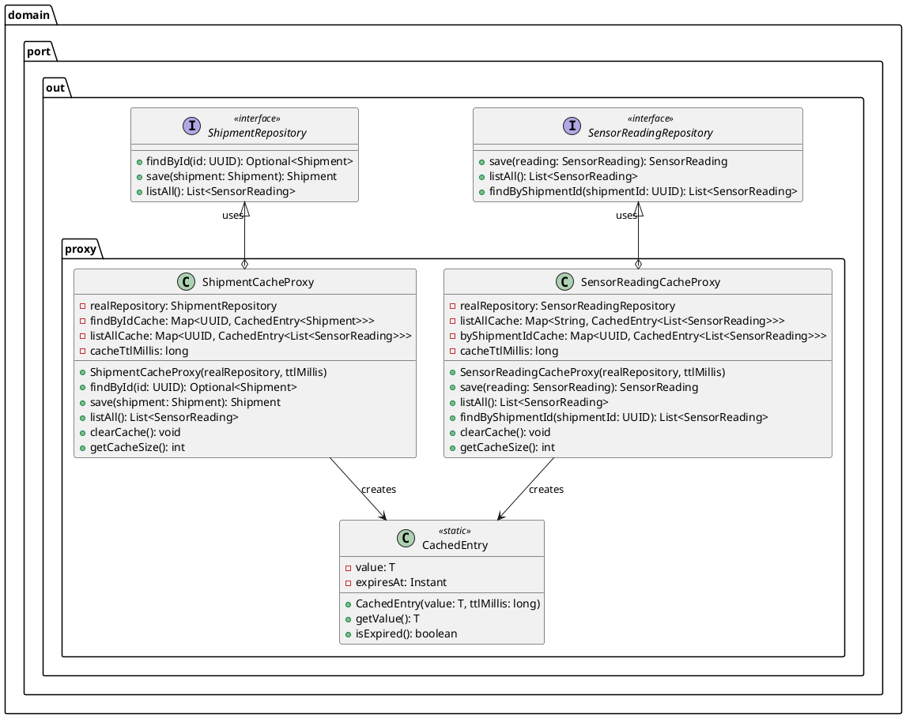
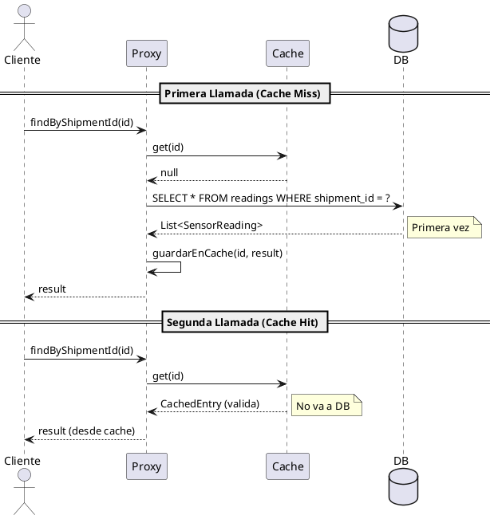
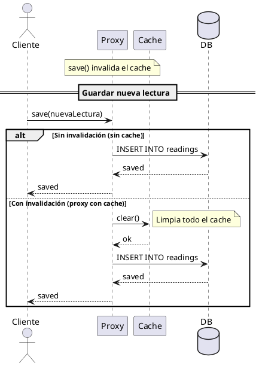

# UML del Patrón Proxy - CadenaSuministros



---

## Diagrama de Flujo de Datos

```plantuml
@startuml
skinparam componentStyle uml2

' ============================================
' FLUJO DE DATOS - CACHE PROXY
' ============================================

actor "Cliente" as client

database "Base de Datos" as db

collections "SensorReadingCacheProxy" as proxy {
    collections "listAllCache" as cache1 {
        [key: "global"]
        [value: CachedEntry]
    }
    collections "byShipmentIdCache" as cache2 {
        [key: UUID1]
        [value: CachedEntry]
        [key: UUID2]
        [value: CachedEntry]
    }
}

' Flujo clientes -> proxy
client -> proxy: findByShipmentId(id)

alt Primera llamada (cache miss)
    proxy -> db: findByShipmentId()
    db --> proxy: List<SensorReading>
    proxy -> proxy: guardando en cache
    proxy --> client: List<SensorReading>
else Llamada siguiente (cache hit)
    proxy -> proxy: buscando en cache
    proxy --> client: List<SensorReading> (desde cache)
end

@enduml
```

---

## Diagrama de Secuencia - Primera vs Segunda Llamada



---

## Diagrama de Invalidez del Cache



---

## Diagrama Comparativo - Sin vs Con Proxy

```plantuml
@startuml
skinparam componentStyle uml2

' ============================================
' COMPARACIÓN - SIN PROXY VS CON PROXY
' ============================================

' --- Sin Proxy ---
container "Sin Proxy" {
    node "Cliente1" as c1
    node "Cliente2" as c2
    node "Cliente3" as c3
    database "Repository (JPA)" as repo1
    
    c1 -> repo1: query
    c2 -> repo1: query
    c3 -> repo1: query
}

note right of c1
  Cada cliente
  consulta DB
end note

' --- Con Proxy ---
container "Con Proxy" {
    node "Cliente1" as c1p
    node "Cliente2" as c2p
    node "Cliente3" as c3p
    collections "CacheProxy" as proxy
    database "Repository (JPA)" as repo2
}

c1p -> proxy: query
proxy -> proxy: Check cache
proxy --> c1p: result (cached)

c2p -> proxy: query
proxy --> c2p: result (cached)

c3p -> proxy: query
proxy --> c3p: result (cached)

repo2 ..> proxy: "never called"

@enduml
```

---

## Ejecutar los Diagramas

Para visualizar los diagramas:
1. Copia el código entre los bloques \`\`\`plantuml
2. Pégalo en [PlantUML Online Editor](https://www.planttext.com)
3. O usa la extensión **PlantUML** en VS Code

---

## Elementos UML Principales

| Elemento | Descripción |
|----------|-------------|
| **SensorReadingRepository** | Interfaz original (Subject) |
| **SensorReadingCacheProxy** | Proxy con cache (Proxy) |
| **ShipmentRepository** | Interfaz original (Subject) |
| **ShipmentCacheProxy** | Proxy con cache (Proxy) |
| **CachedEntry** | Clase interna con TTL |

### Relaciones UML

- `<|..` : Implementación de interfaz
- `o--` : Agregación/composición
- `-->` : Dependencia de creación
- `->` : Flujo de datos