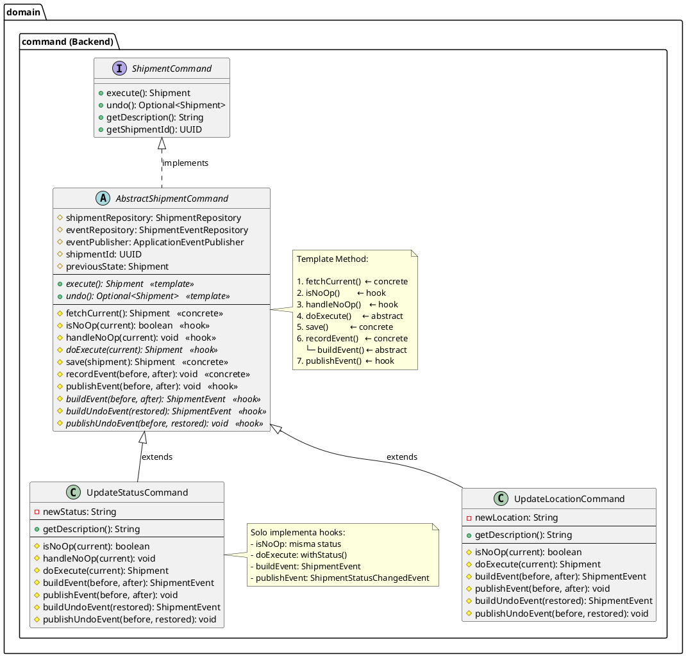
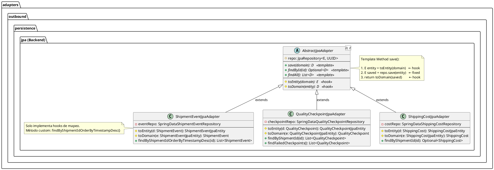
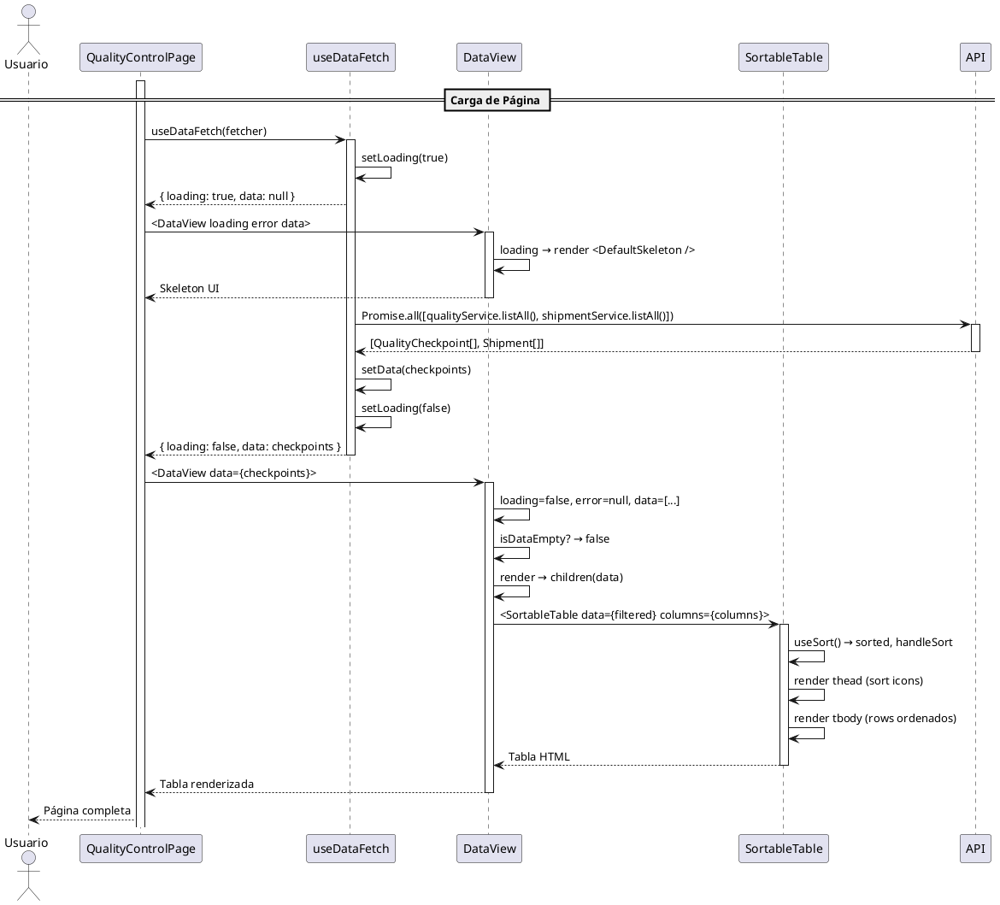

```plantuml
@startuml
skinparam componentStyle uml2

' ============================================
' DIAGRAMA 3: FRONTEND TEMPLATE METHODS
' ============================================

package "hooks" {
    class "useDataFetch<T>" as dataFetch {
        - data: T | null
        - loading: boolean
        - error: string | null
        - mountedRef: MutableRefObject<boolean>
        --
        + {abstract} execute(): void   <<template>>
        ..
        + data: T | null
        + loading: boolean
        + error: string | null
        + refresh: () => void
    }

    note right of dataFetch
      Template:

      1. setLoading(true)
      2. setError(null)
      3. await fetcher()    ← hook
      4. setData(result)    o setError(err)
      5. setLoading(false)
      6. cleanup on unmount
    end note
}

package "components" {

    class "DataView<T>" as dataView {
        - loading: boolean
        - error: string | null
        - data: T | null
        - onRetry: () => void
        - skeleton: ReactNode
        - errorRender: (error, retry) => ReactNode
        - empty: ReactNode
        - isEmpty: (data: T) => boolean
        - children: (data: T) => ReactNode
        --
        + {abstract} render(): ReactNode   <<template>>
    }

    note right of dataView
      Template:

      1. loading? → skeleton   ← hook
      2. error?   → errorRender ← hook
      3. !data?   → null
      4. isEmpty? → empty      ← hook
      5. content  → children(data) ← hook
    end note

    class "SortableTable<T>" as sortableTable {
        - data: T[]
        - columns: Column<T>[]
        - defaultSort: keyof T
        - keyExtractor: (item: T) => string
        --
        + {abstract} render(): ReactNode   <<template>>
    }

    note right of sortableTable
      Template:

      1. useSort() → sorted, sortConfig
      2. render thead (sort icons)
      3. render tbody (sorted data)
      4. empty? → emptyState   ← hook
    end note

    class "DefaultSkeleton" as skel
    class "DefaultError" as err
    class "DefaultEmpty" as empty
    class "DefaultEmptyTable" as emptyTable

    dataView o--> skel : default
    dataView o--> err : default
    dataView o--> empty : default
    dataView o--> emptyTable : default

    sortableTable o--> emptyTable : default
}

package "api" {

    abstract class "CrudService<T>" as crud {
        # {abstract} basePath(): string   <<hook>>
        --
        + {abstract} listAll(): Promise<T[]>   <<template>>
        + {abstract} getById(id: string): Promise<T>   <<template>>
    }

    note right of crud
      Template listAll():

      return api.get<T>(basePath())
                         ↑ hook
    end note

    class "ProductService" as productSvc {
        # basePath(): string
        + create(sku, name): Promise<Product>
    }

    class "SensorService" as sensorSvc {
        # basePath(): string
        + create(request): Promise<SensorReading>
        + listActiveAlerts(): Promise<SensorReading[]>
        + listRecentAlerts(): Promise<SensorReading[]>
        + acknowledgeAlert(id): Promise<SensorReading>
    }

    class "ShipmentService" as shipSvc {
        # basePath(): string
        + create(data): Promise<Shipment>
        + listAllInfo(): Promise<ShipmentInfo[]>
        + getHistory(id): Promise<ShipmentEvent[]>
        + updateStatus(id, status): Promise<Shipment>
        + updateLocation(id, location): Promise<Shipment>
    }

    crud <|-- productSvc : extends
    crud <|-- sensorSvc : extends
    crud <|-- shipSvc : extends
}

package "pages" {
    class "QualityControlPage" as qcPage {
        + render(): ReactNode
    }

    class "ShippingCostPage" as costPage {
        + render(): ReactNode
    }

    class "InventoryPage" as invPage {
        + render(): ReactNode
    }

    class "AuditPanelPage" as auditPage {
        + render(): ReactNode
    }
}

' Relaciones - Páginas usan useDataFetch + DataView
qcPage ..> dataFetch : <<use>>
qcPage ..> dataView : <<use>>
qcPage ..> sortableTable : <<use>>
qcPage ..> productSvc : <<use>>
qcPage ..> shipSvc : <<use>>

costPage ..> dataFetch : <<use>>
costPage ..> dataView : <<use>>
costPage ..> sortableTable : <<use>>

invPage ..> dataFetch : <<use>>
invPage ..> dataView : <<use>>
invPage ..> sortableTable : <<use>>

auditPage ..> dataFetch : <<use>>
auditPage ..> dataView : <<use>>

@enduml
```

```plantuml
@startuml
skinparam componentStyle uml2

' ============================================
' DIAGRAMA 6: ARQUITECTURA TEMPLATE METHOD COMPLETA
' ============================================

package "Backend (Spring Boot)" as backend {

    package "domain.command" {
        component "AbstractShipmentCommand\n<<Template>>" as tmCmd
        component "UpdateStatusCommand\n<<Concrete>>" as statusCmd
        component "UpdateLocationCommand\n<<Concrete>>" as locCmd
    }

    package "persistence.jpa" {
        component "AbstractJpaAdapter<D,E>\n<<Template>>" as tmJpa
        component "ShipmentEventJpaAdapter\n<<Concrete>>" as eventJpa
        component "QualityCheckpointJpaAdapter\n<<Concrete>>" as qcJpa
        component "ShippingCostJpaAdapter\n<<Concrete>>" as costJpa
    }

    tmCmd <|-- statusCmd : extends
    tmCmd <|-- locCmd : extends

    tmJpa <|-- eventJpa : extends
    tmJpa <|-- qcJpa : extends
    tmJpa <|-- costJpa : extends

    note right of tmCmd
        Template Methods:
        - execute()
        - undo()

        Hooks:
        - isNoOp()
        - doExecute()
        - buildEvent()
        - publishEvent()
        - buildUndoEvent()
        - publishUndoEvent()
    end note

    note right of tmJpa
        Template Methods:
        - save()
        - findById()
        - findAll()

        Hooks:
        - toEntity()
        - toDomain()
    end note
}

package "Frontend (React/TypeScript)" as frontend {

    package "hooks" {
        component "useDataFetch<T>\n<<Template>>" as tmFetch
    }

    package "components" {
        component "DataView<T>\n<<Template>>" as tmView
        component "SortableTable<T>\n<<Template>>" as tmTable
        component "DefaultSkeleton\n<<Default>>" as skel
        component "DefaultError\n<<Default>>" as err
        component "DefaultEmpty\n<<Default>>" as empty
        component "DefaultEmptyTable\n<<Default>>" as emptyTable
    }

    package "api" {
        component "CrudService<T>\n<<Template>>" as tmCrud
        component "ProductService\n<<Concrete>>" as prodSvc
        component "SensorService\n<<Concrete>>" as sensSvc
        component "ShipmentService\n<<Concrete>>" as shipSvc
    }

    package "pages" {
        component "QualityControlPage\n<<Client>>" as qcPage
        component "ShippingCostPage\n<<Client>>" as costPage
        component "InventoryPage\n<<Client>>" as invPage
        component "AuditPanelPage\n<<Client>>" as auditPage
    }

    tmCrud <|-- prodSvc : extends
    tmCrud <|-- sensSvc : extends
    tmCrud <|-- shipSvc : extends

    tmView --> skel : default
    tmView --> err : default
    tmView --> empty : default
    tmTable --> emptyTable : default

    qcPage --> tmFetch : uses
    qcPage --> tmView : uses
    qcPage --> tmTable : uses
    qcPage --> shipSvc : uses

    costPage --> tmFetch : uses
    costPage --> tmView : uses
    costPage --> tmTable : uses

    invPage --> tmFetch : uses
    invPage --> tmView : uses
    invPage --> tmTable : uses

    auditPage --> tmFetch : uses
    auditPage --> tmView : uses

    note right of tmFetch
        Template:
        1. setLoading(true)
        2. await fetcher()
        3. setData(result)
        4. setLoading(false)
        Hook: fetcher()
    end note

    note right of tmView
        Template:
        1. loading? → skeleton
        2. error?   → errorRender
        3. empty?   → empty
        4. success  → children(data)
    end note

    note right of tmCrud
        Template:
        - listAll() = api.get(basePath())
        - getById() = api.get(basePath() + "/" + id)
        Hook: basePath()
    end note
}

@enduml
```

# UML del Patrón Template Method - CadenaSuministros



---



---



---

```plantuml
@startuml
skinparam componentStyle uml2

' ============================================
' DIAGRAMA 4: SECUENCIA execute() - TEMPLATE METHOD
' ============================================

actor "Cliente" as client
participant "UpdateStatusCommand" as cmd
participant "AbstractShipmentCommand" as tm
participant "ShipmentRepository" as repo
database "DB" as db

== Template Method: UpdateStatusCommand.execute() ==

client -> cmd: execute()
activate cmd

    cmd -> tm: execute() (hereda de AbstractShipmentCommand)
    activate tm

        ' Paso 1: fetchCurrent (concreto)
        tm -> tm: fetchCurrent()
        tm -> repo: findShipmentById(id)
        activate repo
        repo -> db: SELECT ...
        db --> repo: Shipment row
        repo --> tm: Shipment
        deactivate repo

        ' Paso 2: isNoOp (hook)
        tm -> tm: isNoOp(current)
        note right: current.status().equals(newStatus)?

        alt [isNoOp == true]
            tm -> tm: handleNoOp(current)
            note right: publica evento sin persistir
            tm --> cmd: Shipment
        else [isNoOp == false]
            ' Paso 3: previousState
            tm -> tm: previousState = current

            ' Paso 4: doExecute (hook abstracto)
            tm -> tm: doExecute(current)
            note right: current.withStatus(newStatus)

            ' Paso 5: save (concreto)
            tm -> tm: save(updated)
            tm -> repo: save(updated)
            activate repo
            repo -> db: UPDATE ...
            db --> repo: OK
            repo --> tm: Shipment saved
            deactivate repo

            ' Paso 6: recordEvent (concreto, usa buildEvent abstracto)
            tm -> tm: recordEvent(current, saved)
            tm -> tm: buildEvent(current, saved)   ← hook abstracto
            note right: new ShipmentEvent(...)

            ' Paso 7: publishEvent (hook)
            tm -> tm: publishEvent(current, saved)
            note right: eventPublisher.publishEvent(
            ShipmentStatusChangedEvent)

            tm --> cmd: Shipment saved
        end

    deactivate tm
cmd --> client: Shipment
deactivate cmd

@enduml
```

---



---



---

## Descripción de los Diagramas

### 1. Diagrama de Clases — AbstractShipmentCommand
Muestra la jerarquía del Template Method en el backend para comandos de actualización:
- `AbstractShipmentCommand` define los templates `execute()` y `undo()` con 7 hooks (3 abstractos, 4 con default)
- `UpdateStatusCommand` y `UpdateLocationCommand` extienden la clase base e implementan solo los hooks relevantes
- La nota detalla el algoritmo completo del template `execute()`

### 2. Diagrama de Clases — AbstractJpaAdapter
Muestra la jerarquía del Template Method para persistencia JPA:
- `AbstractJpaAdapter<D,E>` define los templates `save()`, `findById()`, `findAll()` con 2 hooks abstractos (`toEntity`, `toDomain`)
- 3 adaptadores concretos implementan solo los hooks de mapeo y agregan métodos custom (queries específicas)

### 3. Diagrama de Clases — Frontend
Muestra los 4 templates del frontend y sus consumidores:
- **`useDataFetch<T>`**: hook template para el ciclo de fetch
- **`DataView<T>`**: componente template para el render loading/error/empty/content
- **`SortableTable<T>`**: componente template para tablas ordenables
- **`CrudService<T>`**: clase abstracta template para servicios API
- **Páginas**: `QualityControlPage`, `ShippingCostPage`, `InventoryPage`, `AuditPanelPage` consumen los templates
- **Defaults**: `DefaultSkeleton`, `DefaultError`, `DefaultEmpty`, `DefaultEmptyTable` son implementaciones por defecto de los hooks

### 4. Diagrama de Secuencia — execute()
Flujo completo de `UpdateStatusCommand.execute()`:
1. `fetchCurrent()` → consulta DB (paso concreto)
2. `isNoOp()` → hook: si el status ya es el mismo, solo publica evento y retorna
3. `doExecute()` → hook abstracto: `current.withStatus(newStatus)`
4. `save()` → paso concreto: `repository.save()`
5. `recordEvent()` → paso concreto que usa `buildEvent()` (hook abstracto)
6. `publishEvent()` → hook: publica `ShipmentStatusChangedEvent`

### 5. Diagrama de Secuencia — DataView Render
Flujo de renderizado de una página que usa DataView:
1. `useDataFetch` inicia con loading=true → DataView muestra skeleton
2. Fetch exitoso → data cargada → loading=false
3. DataView verifica: loading? no → error? no → empty? no → renderiza children
4. `SortableTable` recibe datos filtrados, aplica sort, renderiza tabla

### 6. Diagrama de Arquitectura Completa
Vista general de todos los Template Methods implementados en backend y frontend:
- **Backend**: 2 templates (AbstractShipmentCommand, AbstractJpaAdapter) con 5 clases concretas
- **Frontend**: 4 templates (useDataFetch, DataView, SortableTable, CrudService) con defaults, consumidos por 4 páginas y 3 servicios

---

## Elementos UML Principales

### Backend

| Elemento | Tipo | Template | Hooks |
|----------|------|----------|-------|
| **AbstractShipmentCommand** | AbstractClass | `execute()`, `undo()` | `isNoOp`, `doExecute`, `buildEvent`, `publishEvent`, `buildUndoEvent`, `publishUndoEvent` |
| **UpdateStatusCommand** | ConcreteClass | Usa template | `isNoOp` (misma status), `doExecute` (withStatus), `buildEvent` (ShipmentEvent), `publishEvent` (ShipmentStatusChangedEvent) |
| **UpdateLocationCommand** | ConcreteClass | Usa template | `isNoOp` (misma location), `doExecute` (withLocation), `buildEvent` (ShipmentEvent), `publishEvent` (ShipmentLocationChangedEvent) |
| **AbstractJpaAdapter<D,E>** | AbstractClass | `save()`, `findById()`, `findAll()` | `toEntity`, `toDomain` |
| **ShipmentEventJpaAdapter** | ConcreteClass | Usa template | `toEntity`/`toDomain` (ShipmentEvent ↔ ShipmentEventJpaEntity) |
| **QualityCheckpointJpaAdapter** | ConcreteClass | Usa template | `toEntity`/`toDomain` (QualityCheckpoint ↔ QualityCheckpointJpaEntity) |
| **ShippingCostJpaAdapter** | ConcreteClass | Usa template | `toEntity`/`toDomain` (ShippingCost ↔ ShippingCostJpaEntity) |

### Frontend

| Elemento | Tipo | Template | Hooks |
|----------|------|----------|-------|
| **useDataFetch<T>** | Hook | Ciclo fetch | `fetcher()` |
| **DataView<T>** | Component | Render | `skeleton`, `errorRender`, `empty`, `isEmpty`, `children` |
| **SortableTable<T>** | Component | Render tabla | `columns[].render()`, `emptyState`, `keyExtractor` |
| **CrudService<T>** | AbstractClass | `listAll()`, `getById()` | `basePath()` |
| **ProductService** | ConcreteClass | Usa template | `basePath = '/products'` |
| **SensorService** | ConcreteClass | Usa template | `basePath = '/sensors'` |
| **ShipmentService** | ConcreteClass | Usa template | `basePath = '/shipments'` |
| **QualityControlPage** | Client | Consume | fetcher + columns |
| **ShippingCostPage** | Client | Consume | fetcher + columns |
| **InventoryPage** | Client | Consume | fetcher + columns |
| **AuditPanelPage** | Client | Consume | fetcher |

### Flujos Template

#### Backend: AbstractShipmentCommand.execute()
```
fetchCurrent() → isNoOp()? → [no-op: handleNoOp()] → doExecute() → save() → recordEvent(buildEvent()) → publishEvent()
```

#### Backend: AbstractJpaAdapter.save()
```
toEntity() → repo.save() → toDomain()
```

#### Frontend: useDataFetch + DataView
```
[loading=true → DataView: skeleton] → fetcher() → [error → DataView: errorRender] → [empty → DataView: empty] → [data → DataView: children(data)]
```

#### Frontend: CrudService.listAll()
```
api.get(basePath())  ← basePath() es el hook
```

---

## Ejecutar los Diagramas

Para visualizar los diagramas:
1. Copia el código entre los bloques ```plantuml
2. Pégalo en [PlantUML Online Editor](https://www.planttext.com)
3. O usa la extensión **PlantUML** en VS Code
